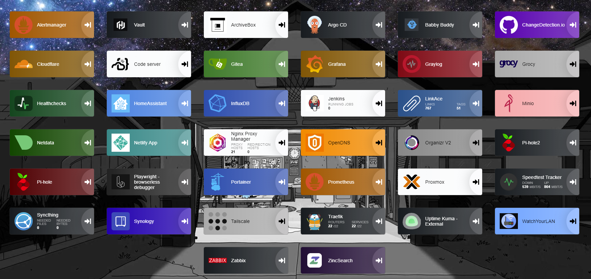

<h1 align="left">Hi 👋, I'm Tim Bryant</h1>
<h3 align="left">Passionate about Observability, Site Reliability, DevOps, and Automation</h3>

- 🌱 I’m currently learning **kubernetes, gitops, python**

- 📝 I sometimes write articles on [My Blog](https://blog.timothybryantjr.com)

- 🌐 Website [🖥️ Official](https://profile.timothybryantjr.com)

- ⚡ Hobbies **learning new things, breaking and fixing things in my home-lab, watching sports, car detailing, working on my yard**

<h3 align="left">Homelab:</h3>

I run a home-lab within my house and even though its small, it is a blast to play with and I learn a lot from it. The following equipment is what I have in my home-lab:

- **Dell Optiplex 5000 PC**: running Proxmox VE
- **Two Beelink Mini PCs**: one running Proxmox VE and one running primary pihole for local dns
- **RasberryPI3**: runs backup pihole and act as qdevice for Proxmox HA
- **Synology NAS** (DS416slim): for file and object storage (via minio)
- **eero6 router & mesh network**
- **TP-Link un-managed gig switch**
- **APC UPS Pro 1500VA**: for power protection

Within my home-lab I run several different open-source apps, tools, and services. Most of them are deployed within my k3s cluster but some are deployed using docker or directly on the VM's. For example, I use docker to deploy and backup my pihole instances, while my PostgreSQL database and Zabbix monitoring server are deployed directly on VM's. A few other points to note:

- I use [traefik](https://traefik.io/) as my reverse proxy within Kubernetes and for everything else I use [nginx proxy manager](https://nginxproxymanager.com/).
- I pay for and use [tailscale](https://tailscale.com/) (highly recommend) as my VPN to access my home-lab from anywhere.
- I use a mix of [portainer](https://www.portainer.io/) to manage my docker containers and [Lens](https://k8slens.dev/) to manage my k3s cluster. While I love the terminal, I find it nice to use GUI's to manage things sometimes.
- I'm using [argocd](https://argoproj.github.io/cd/) for gitops within my k3s cluster. As of now, about half my services are deployed using argocd, but I'm working to make it all of them. 
- For secrets management, I use [vault](https://developer.hashicorp.com/vault) and the [argocd-vault-plugin](https://github.com/argoproj-labs/argocd-vault-plugin) to inject secrets into my pods as part of my gitops workflow. I intend to use vault for all my secrets management in the future, but only recently started using it. For other secrets, I use the command line tool `envsubst` to inject secrets directly into my manifests and docker-compose files.
- For monitoring, I use a mix of tools including [prometheus](https://prometheus.io/), [grafana](https://grafana.com/), and [alertmanager](https://prometheus.io/docs/alerting/latest/alertmanager/) via the [kube-prometheus-stack](https://github.com/prometheus-community/helm-charts/tree/main/charts/kube-prometheus-stack). I also use [zabbix](https://www.zabbix.com/) for monitoring my network and VM's. Lastly, I use [uptime-kuma](https://github.com/louislam/uptime-kuma) to monitor my websites and the availability of my services and hosts.
- For local dns I use [pihole](https://pi-hole.net/) and for ad-blocking I use a mix of pihole and [OpenDNS](https://www.opendns.com/).

Finally, here is a screenshot showing a list of all the applications that are currently deployed in my home-lab:

If you are interested in learning more about how I operate my home-lab, I have repositories on GitHub that contain all the manifests, docker-compose files, and scripts that I use to deploy everything. You can find them here:

- **[configs](https://github.com/timmyb824/configs)**
- **[automations](https://github.com/timmyb824/automations)**
- **[docker-apps](https://github.com/timmyb824/docker-apps)**
- **[kubernetes-apps](https://github.com/timmyb824/kubernetes-apps)**

<h3 align="left">Connect with me:</h3>

<h3 align="left">Stats:</h3>

&nbsp;

