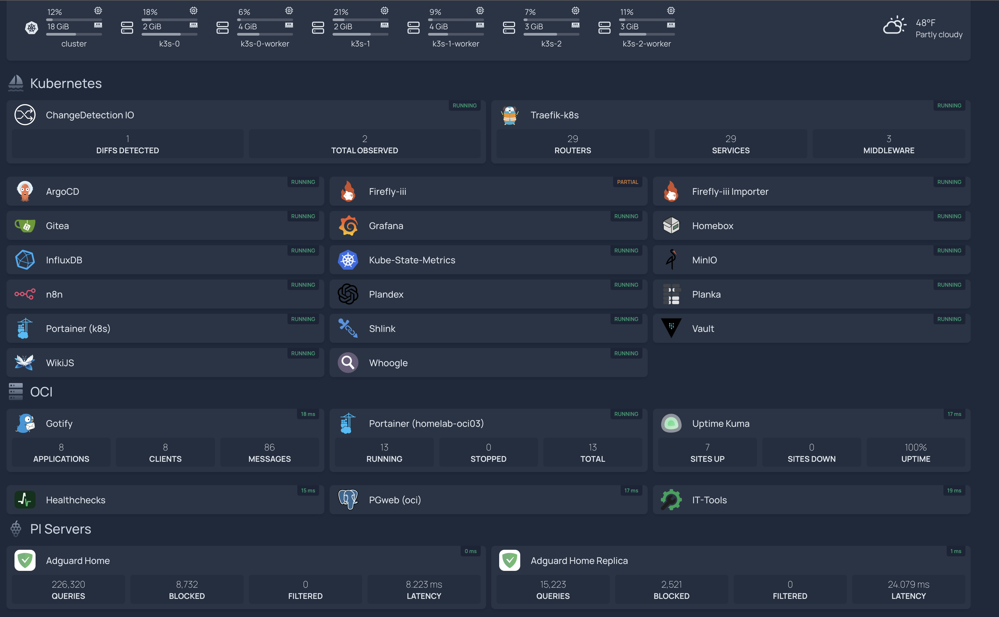

<h1 align="left">Hi 👋, I'm Tim Bryant</h1>
<h3 align="left">Passionate about Observability, Site Reliability, DevOps, and Automation</h3>

- 🌱 I’m currently working on [python-SysInformer](https://github.com/timmyb824/python-sysinformer) and [python-URLChecker](https://github.com/timmyb824/python-urlchecker)

- 📝 I sometimes write articles on [My Blog](https://blog.timothybryantjr.com)

- 🌐 Website [🖥️ Official](https://timothybryantjr.com)

- ⚡ Hobbies **learning new things, breaking and fixing things in my home-lab, watching sports, car detailing, working on my yard**

<h3 align="left">Homelab:</h3>

I run a small yet exciting home-lab within my house, where I constantly experiment and gain valuable knowledge. Here's a list of the equipment I currently have in my home-lab:

- **Dell Optiplex 5000 PC**: running Proxmox VE which hosts my k3s cluster
- **Two Beelink Mini PCs**:
  1. running Proxmox VE (clustered with the Dell Optiplex 5000 PC)
  2. running several [podman](https://podman.io/) containers including my primary adguard-home for local dns and various cron jobs scripts
- **RasberryPI3**: runs replica adguard-home and acts as [qdevice](https://blog.jenningsga.com/proxmox-keeping-quorum-with-qdevices/) to ensure Proxmox HA
- **Synology NAS** (DS923+): for file storage
- **eero6 router & mesh network**
- **TP-Link un-managed gig switch**
- **APC UPS Pro 1500VA**: for power protection
- **Old HP Laptop**: running Ubuntu server and used for adhoc tasks

Within my home lab, I operate multiple open-source applications, tools, and services. The majority of these are deployed within my k3s cluster, although some are deployed using docker/podman or directly on the VMs. For example, I utilize podman for deploying and backing up my adguardhome instances, whereas my PostgreSQL and MySQL databases are directly deployed on the VMs. It is worth noting a few additional details:

- I employ [traefik](https://traefik.io/) as my reverse proxy for all components, including Kubernetes.
- To access my home lab from anywhere, I rely on [tailscale](https://tailscale.com/) (highly recommended) as my VPN solution.
- I use [Lens](https://k8slens.dev/) to help manage my k3s cluster. Although I enjoy working with the terminal, I find GUIs useful for certain management tasks.
- [argocd](https://argoproj.github.io/cd/) serves as my gitops tool within the k3s cluster. Currently, approximately 75% of my services are deployed using argocd. However, I am cautious about relying entirely on argocd due to its potential impact on the cluster's performance.
- To handle secrets, I utilize [vault](https://developer.hashicorp.com/vault) and the [argocd-vault-plugin](https://github.com/argoproj-labs/argocd-vault-plugin) to inject secrets into pods as part of my gitops workflow.
- For monitoring, I employ a combination of tools such as [prometheus](https://prometheus.io/), [grafana](https://grafana.com/), and [netdata](https://netdata.cloud). I previously used the [kube-prometheus-stack](https://github.com/prometheus-community/helm-charts/tree/main/charts/kube-prometheus-stack) but found it to be too resource intensive for my little cluster. Additionally, I rely on [uptime-kuma](https://github.com/louislam/uptime-kuma) to monitor the availability of my public facing services and websites. These are exposed to the internet either using [CloudFlare Pages](https://pages.cloudflare.com/) or [Cloudflare Tunnels](https://developers.cloudflare.com/cloudflare-one/connections/connect-networks/).
- To handle local DNS, I rely on [adguardhome](https://github.com/AdguardTeam/AdGuardHome), and for ad-blocking, I combine adguardhome with [cloudflare](https://www.cloudflare.com/).

Apart from my home-lab, I have deployed multiple servers within [Oracle Cloud Infrastructure (OCI)](https://www.oracle.com/cloud/) to host various services. I use OCI over AWS or GCP because they have a very generous free tier that allows me run multiple servers without incurring any costs. These servers are deployed and manged using [Terraform](https://www.terraform.io/) and [Terraform Cloud](https://app.terraform.io/session).

Finally, here is a screenshot showing some (but not all) of the applications that are currently deployed in my home-lab:

If you wish to delve deeper into my home-lab's operations, I have GitHub repositories housing the manifests, docker-compose files, and scripts that facilitate most of my deployments. You can locate them here:

- **[dotfiles](https://github.com/timmyb824/dotfiles)**
- **[ansible](https://github.com/timmyb824/automation_ansible)**
- **[terraform](https://github.com/timmyb824/automation_terraform)**
- **[pyinfra](https://github.com/timmyb824/automation_pyinfra)**
- **[packer](https://github.com/timmyb824/automation_packer)**
- **[docker-apps](https://github.com/timmyb824/docker-apps)**
- **[kubernetes-apps](https://github.com/timmyb824/kubernetes-apps)**

<h3 align="left">Connect with me:</h3>

<h3 align="left">Stats:</h3>

&nbsp;

<!-- Old card version:
 -->
